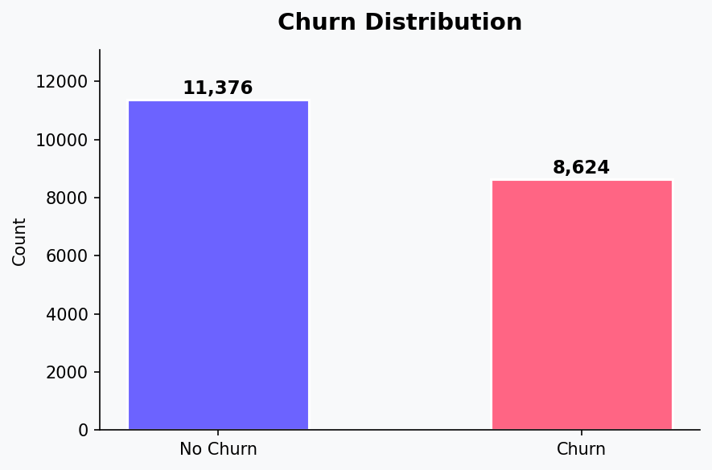
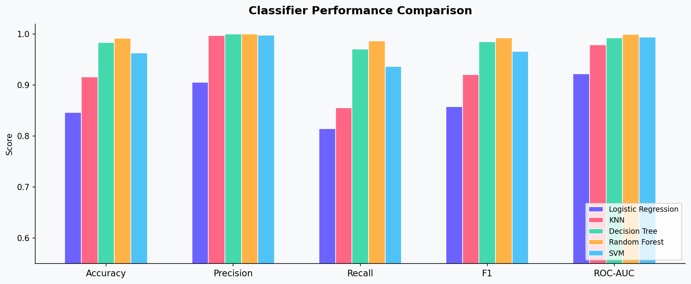
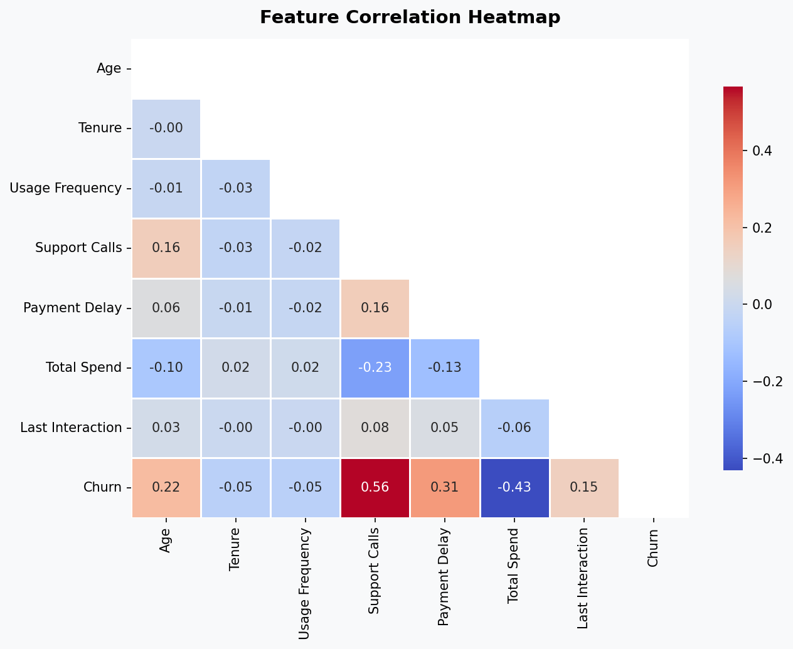
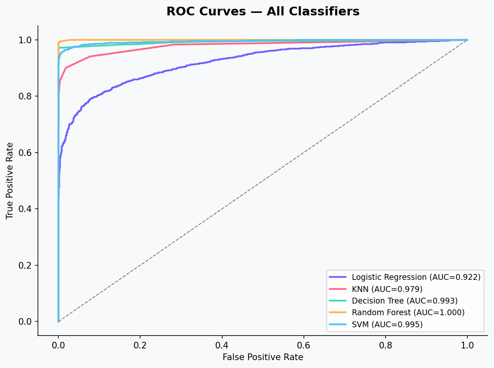
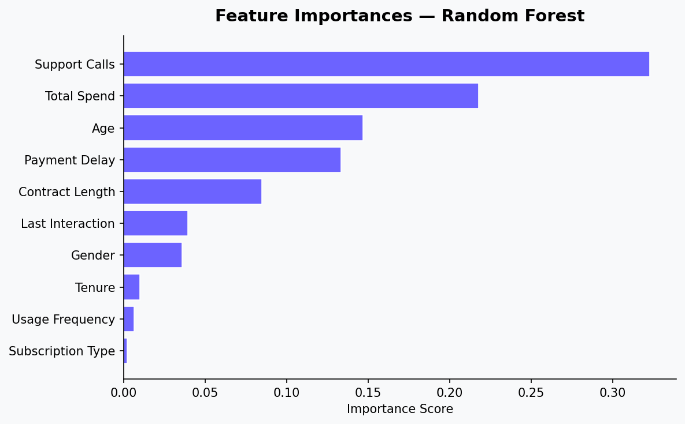
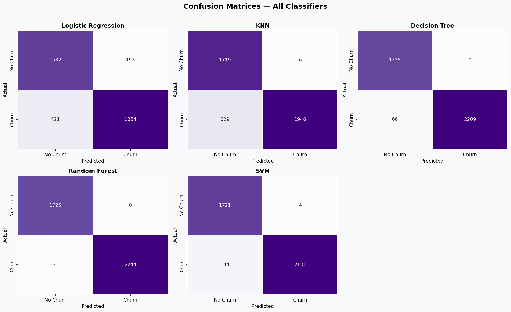

<div align="center">

# 🎯 Classifier Showdown: Churn Prediction

[](https://python.org)
[](https://scikit-learn.org)
[](https://jupyter.org)
[](LICENSE)
[]()

**Comparative analysis of 5 classifiers for telecom customer churn prediction**  
*Systematic model selection · Hyperparameter tuning · Business recommendation*

[📓 Notebook](#-notebook) · [📊 Results](#-results) · [🚀 Quick Start](#-quick-start) · [📁 Structure](#-project-structure)

---

</div>

## 📌 Project Overview

This project applies a **systematic machine learning workflow** to predict telecom customer churn using a 440,833-row dataset. Five classifiers are rigorously compared — Logistic Regression, KNN, Decision Tree, Random Forest, and SVM — using cross-validation, GridSearchCV tuning, and a held-out test evaluation. A final business recommendation is derived from both statistical performance and real-world cost considerations.

> **Course:** Machine Learning · Weekend Assignment 3  
> **Author:** Mehr Ali | [GitHub](https://github.com/Astreonix) · [Kaggle](https://kaggle.com/mehralieng)

---

## 📊 Results

| Model | Accuracy | Precision | Recall | F1 | ROC-AUC |
|---|---|---|---|---|---|
| Logistic Regression | 0.8465 | 0.9057 | 0.8149 | 0.8579 | 0.9224 |
| KNN | 0.9162 | 0.9969 | 0.8554 | 0.9207 | 0.9791 |
| Decision Tree | 0.9835 | 1.0000 | 0.9710 | 0.9853 | 0.9926 |
| **Random Forest** ⭐ | **0.9922** | **1.0000** | **0.9864** | **0.9931** | **0.9999** |
| SVM | 0.9630 | 0.9981 | 0.9367 | 0.9664 | 0.9946 |

**🏆 Winner: Random Forest** — Highest F1 (0.993) and near-perfect ROC-AUC (0.9999).

---

## 🖼️ Visualizations

<div align="center">

| EDA | Model Performance |
|---|---|
|  |  |
|  |  |
|  |  |

</div>

---

## 🚀 Quick Start

### 1. Clone the repository
```bash
git clone https://github.com/mehrali-hub/classifier-showdown-churn.git
cd classifier-showdown-churn
```

### 2. Install dependencies
```bash
pip install -r requirements.txt
```

### 3. Run the notebook
```bash
jupyter notebook ClassifierShowdown_MehrAli.ipynb
```

---

## 📁 Project Structure

```
classifier-showdown-churn/
│
├── 📓 ClassifierShowdown_MehrAli.ipynb   # Main notebook (all code + outputs)
│
├── 📂 data/
│   ├── churn_sample_20k.csv              # 20K-row working sample
│   └── model_comparison_results.csv      # Final metrics summary table
│
├── 📂 images/
│   ├── 01_churn_distribution.png
│   ├── 02_correlation_heatmap.png
│   ├── 03_age_distribution.png
│   ├── 04_subscription_churn.png
│   ├── 05_support_calls_boxplot.png
│   ├── 06_contract_churn.png
│   ├── 07_model_comparison.png
│   ├── 08_cv_f1_boxplot.png
│   ├── 09_confusion_matrices.png
│   ├── 10_roc_curves.png
│   └── 11_feature_importance.png
│
├── 📄 requirements.txt
├── 📄 README.md
└── 📄 LICENSE
```

---

## 🗂️ Dataset

- **Source:** [Kaggle — Customer Churn Dataset](https://www.kaggle.com/datasets/muhammadshahidazeem/customer-churn-dataset)
- **Full size:** 440,833 rows · 12 features
- **Working sample:** 20,000 rows (stratified, `random_state=42`)
- **Target:** `Churn` (binary: 0 = retained, 1 = churned)

| Feature | Type | Description |
|---|---|---|
| Age | Numeric | Customer age |
| Gender | Categorical | Male / Female |
| Tenure | Numeric | Months as customer |
| Usage Frequency | Numeric | Monthly usage events |
| Support Calls | Numeric | Support contacts made |
| Payment Delay | Numeric | Days payment delayed |
| Subscription Type | Categorical | Basic / Standard / Premium |
| Contract Length | Categorical | Monthly / Quarterly / Annual |
| Total Spend | Numeric | Lifetime spend ($) |
| Last Interaction | Numeric | Days since last interaction |

---

## ⚙️ Methodology

```
Raw Data (440K rows)
       ↓
  Stratified Sample (20K)
       ↓
  EDA & Visualization
       ↓
  Preprocessing (Label Encoding, Standard Scaling)
       ↓
  5-Fold CV → 5 Classifiers
       ↓
  GridSearchCV Tuning (LR + RF)
       ↓
  Held-out Test Evaluation
       ↓
  Business Recommendation
```

### Classifiers
- **Logistic Regression** — Linear baseline; interpretable coefficients
- **K-Nearest Neighbors** — Distance-based; sensitive to scale
- **Decision Tree** — Tree-based; highly interpretable rules
- **Random Forest** ⭐ — Ensemble of trees; robust, scalable
- **SVM (RBF Kernel)** — Margin-based; strong on high-dim data

### Tuning
- GridSearchCV with 3-fold CV on `F1` metric
- **LR:** Regularization `C ∈ {0.01, 0.1, 1, 10}` → Best: `C=1`
- **RF:** `n_estimators ∈ {100, 200}`, `max_depth ∈ {8, 12, None}` → Best: `depth=None, n=100`

---

## 💼 Business Recommendation

> **Deploy Random Forest.** With F1 = 0.993 and recall = 98.6%, virtually no at-risk customer goes undetected. In churn scenarios, **false negatives** (missed churners) are far more expensive than false positives — a wrongly flagged customer costs a small retention offer; a missed churner costs full acquisition spend. Random Forest also yields interpretable feature importances: **Support Calls** and **Payment Delay** are the strongest churn signals, enabling proactive outreach before customers disengage.

---

## 🛠️ Requirements

```
pandas>=2.0
numpy>=1.24
scikit-learn>=1.4
matplotlib>=3.7
seaborn>=0.12
jupyter
```

---

## 📄 License

This project is licensed under the **MIT License** — see [LICENSE](LICENSE) for details.

---

<div align="center">

Made with ❤️ by **Mehr Ali**  
[GitHub](https://github.com/mehrali-hub) · [Kaggle](https://kaggle.com/mehralieng)

⭐ Star this repo if you found it useful!

</div>
